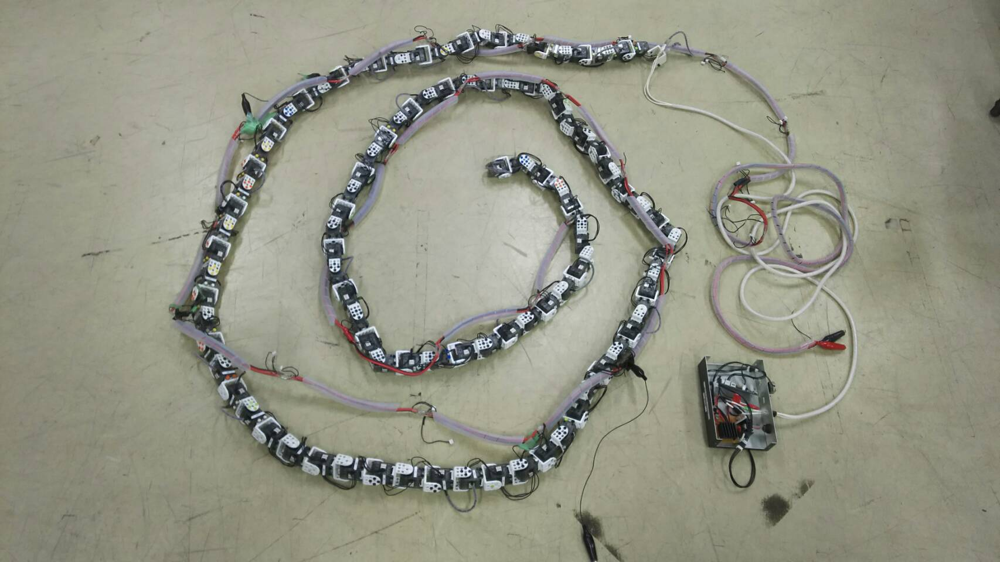
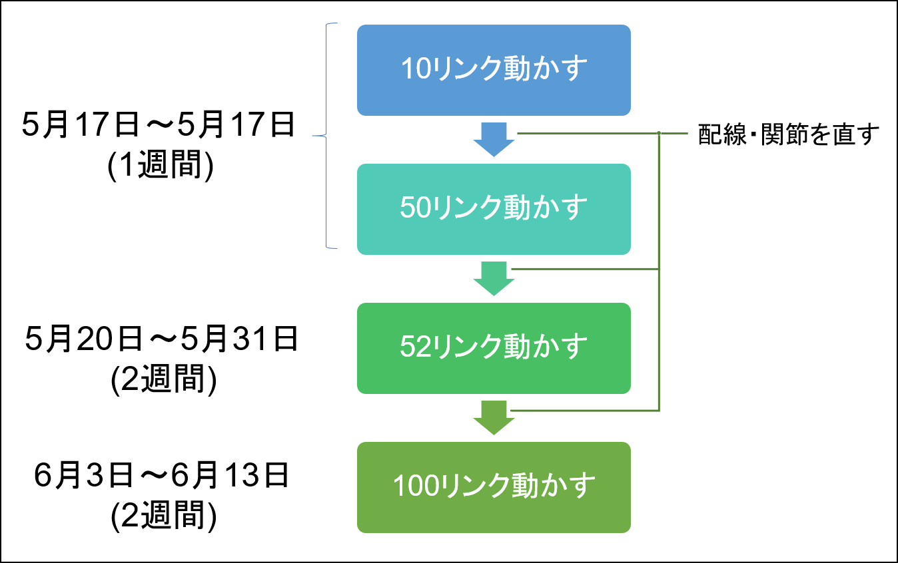

# 20190510_研究報告資料

氏名：田村　玄

期間：2019/11/15 ～ 2020/03/22

## この期間の研究内容

- PCの環境設定
- 研究グループの選択
- 100リンクヘビ型ロボットの確認・修理計画

## 研究の経過と結果

### PCの環境設定

PCにOSをインストールし，ネットワーク，メールエイリアス，プリンターの設定を行った．
そしてNASLINK内に自分用の個人フォルダを作成した．
Office365，ウィルスバスタークラウドなどの基本的なソフトウェアをインストールしたあと，研究に必要なソフトウェアとしてTeX WorksとVMware Workstatioをインストールした．
VMware Workstatioには，Ubuntu 14.04をインストールした．

### 研究グループの選択

以前から，ヘビ型ロボットに代表される生物工学というアプローチが，システム工学における重要な要素を多く含んでいると感じていた．
先生や先輩方からヘビグループの研究に関する説明を聞き，ヘビ型ロボットに関する論文を読んだことで，この感覚はさらに大きくなった．
ヘビ型ロボットの研究を経験すれば，「私はシステム工学出身だ」と胸を張って言えそうだと考え，研究グループをヘビグループに決めた．

### 100リンクヘビ型ロボットの確認・修理計画

100リンクヘビ型ロボットの修理を行う必要があるため，このロボットについて王さんから説明をいただいた．
100リンクヘビ型ロボットの外観をFig.1に示す．
まず，配線がどのようになっているかの説明を受け，コントローラとプログラムの開発環境についての説明を受けた．
コントローラの外観をFig.2に示す．
マイコンボードにはArduinoが使われており，プログラムはC言語で記述する．
またこのロボットの現状の問題点の説明を受け，52リンク以上つなげると正常に動作しないということを聞き，修理手順に関する助言をいただいた．

その後，もう一人のヘビグループ4回生である久戸瀬と修理計画を立てた．
今回立てた修理計画をFig.3に示す．
勉強もかねて10リンク，50リンクと徐々にリンクを増やして動かしていき，6月13日までに100リンクつなげて動かすことを目標とする．
最大の課題は52リンク以上つなげると正常に動作しないことがであり，これの解決に時間を割けるように計画を立てた．

## 次の期間の研究

- 100リンクヘビ型ロボットを50リンクまで動かす
- ROSのインストール
- 広瀬先生の本(生物機械工学)を読む
